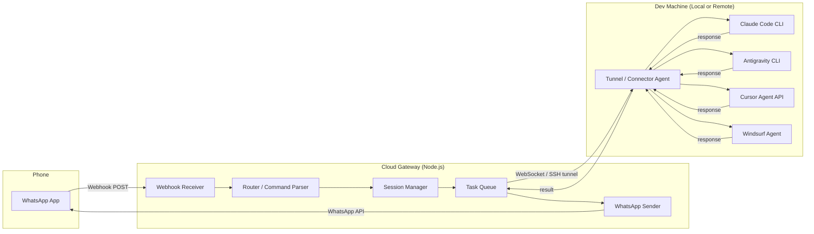
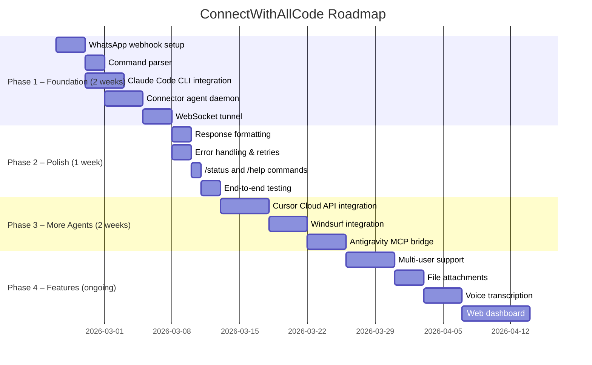

# ConnectWithAllCode — Product Specification

> **One WhatsApp number. Four coding agents. Code from anywhere.**

---

## 1. Problem Statement

Modern developers use multiple AI coding agents — Claude Code, Antigravity, Cursor, and Windsurf — each excelling in different areas. But they're all locked behind desktop IDEs or terminal sessions. When you're away from your desk — commuting, in a meeting, or on your phone — you lose access to your most powerful development tools.

**ConnectWithAllCode** bridges that gap by exposing all four agents through the interface you already have in your pocket: **WhatsApp**.

---

## 2. Product Vision

A lightweight middleware service that:

1. Receives messages from WhatsApp via the **WhatsApp Business Cloud API**
2. Routes them to the correct coding agent based on a simple command prefix
3. Executes the task on your local or remote dev machine
4. Streams the response back to WhatsApp

```
You (WhatsApp)  →  Gateway Server  →  Agent Runner  →  Agent (on your machine)
                       ↑                                     ↓
                   WhatsApp API  ←────── Response ──────────←─┘
```

---

## 3. Target User

- Solo developers or small-team leads who use 2+ AI coding agents daily
- Power users who want to trigger code tasks while AFK (away from keyboard)
- Developers already comfortable with CLI-style interactions

---

## 4. Core User Flows

### 4.1 Send a task to a specific agent

```
User sends:   /claude review the auth middleware in src/auth.ts
Bot replies:  🤖 Claude Code | Task received. Running...
Bot replies:  ✅ Claude Code | Review complete:
              - Line 23: Missing null check on token payload
              - Line 41: Consider using httpOnly cookie instead
              - ...
```

### 4.2 Switch agents mid-conversation

```
User sends:   /cursor fix the null check Claude found on line 23 of src/auth.ts
Bot replies:  🤖 Cursor | Applying fix...
Bot replies:  ✅ Cursor | Fixed. Diff:
              - const payload = jwt.decode(token);
              + const payload = jwt.decode(token) ?? {};
```

### 4.3 Check agent availability

```
User sends:   /status
Bot replies:  📊 Agent Status:
              ✅ Claude Code  — online (local)
              ✅ Antigravity  — online (local)
              ⚠️  Cursor       — offline (IDE not running)
              ✅ Windsurf     — online (remote)
```

### 4.4 Set default agent & workspace

```
User sends:   /default claude ~/projects/my-api
Bot replies:  ✅ Default set: Claude Code → ~/projects/my-api
              Future messages without a prefix go to Claude Code.
```

---

## 5. Architecture

### 5.1 High-Level System Diagram



### 5.2 Components

| Component | Tech | Purpose |
|---|---|---|
| **Webhook Receiver** | Node.js + Express | Receives inbound WhatsApp messages via Meta Cloud API webhooks |
| **Command Parser** | Custom, regex-based | Extracts agent prefix (`/claude`, `/cursor`, etc.), command, and arguments |
| **Session Manager** | Redis | Tracks per-user state: default agent, active workspace, conversation context |
| **Task Queue** | BullMQ (Redis-backed) | Queues tasks, handles retries, and manages concurrency per agent |
| **Tunnel / Connector Agent** | Lightweight daemon on dev machine | Maintains a persistent WebSocket connection to the cloud gateway; dispatches tasks to local agent CLIs |
| **WhatsApp Sender** | Meta Cloud API client | Sends formatted responses back to the user on WhatsApp |

---

## 6. Agent Integration Details

### 6.1 Claude Code

| Aspect | Detail |
|---|---|
| **Interface** | Claude Code SDK / CLI in headless mode |
| **Invocation** | `claude -p "your prompt" --output-format json` |
| **Auth** | `ANTHROPIC_API_KEY` environment variable |
| **Capabilities** | Code review, generation, refactoring, multi-file edits, test writing |
| **Streaming** | Supported via `--output-format stream-json` |
| **Workspace** | Set via `--directory` flag or `cwd` |

### 6.2 Antigravity (Google DeepMind)

| Aspect | Detail |
|---|---|
| **Interface** | Antigravity runs as an agent within VS Code / IDE extensions — no standalone CLI |
| **Integration Strategy** | Use the **MCP (Model Context Protocol)** bridge: Antigravity exposes MCP tools → Connector Agent invokes them programmatically via MCP client SDK |
| **Auth** | Google OAuth / API key depending on deployment |
| **Capabilities** | Full agentic coding — file edits, terminal commands, browser control, search |
| **Workspace** | Configurable per MCP session |

### 6.3 Cursor

| Aspect | Detail |
|---|---|
| **Interface** | **Cursor Cloud Agents API** (enterprise) or **Background Agents** |
| **Invocation** | REST API call to Cloud Agents endpoint to create a task |
| **Auth** | API key via Cursor enterprise dashboard |
| **Capabilities** | Multi-file edits, terminal commands, agent-mode task execution |
| **Fallback** | If no API access, use Cursor's VS Code extension via a headless VS Code server (`code-server`) and send commands through its extension API |

### 6.4 Windsurf (Codeium)

| Aspect | Detail |
|---|---|
| **Interface** | Windsurf Cascade CLI / API or headless IDE integration |
| **Invocation** | API call or CLI command to Cascade |
| **Auth** | Codeium API key |
| **Capabilities** | Agentic coding with full workspace awareness, terminal interaction |
| **Fallback** | Use MCP bridge similar to Antigravity if direct API is unavailable |

---

## 7. Command Syntax

```
/<agent> <prompt>              — Send a task to a specific agent
/status                        — Show connectivity status of all agents
/default <agent> [workspace]   — Set default agent and optional workspace
/history                       — Show last 10 tasks and their results
/cancel                        — Cancel the currently running task
/help                          — Show available commands
```

**Agent aliases:**
| Prefix | Agent |
|---|---|
| `/claude` or `/cc` | Claude Code |
| `/anti` or `/ag` | Antigravity |
| `/cursor` or `/cu` | Cursor |
| `/wind` or `/ws` | Windsurf |

**No-prefix messages** are routed to the default agent (or prompt the user to pick one).

---

## 8. WhatsApp Integration

### 8.1 Setup Requirements

1. **Meta Business Manager** account (verified)
2. **WhatsApp Business Cloud API** access
3. A dedicated phone number (not used by regular WhatsApp)
4. Webhook URL (publicly accessible HTTPS endpoint)
5. Verification token for webhook registration

### 8.2 Message Handling

- **Inbound**: Meta sends a webhook `POST` with the message payload. The gateway parses and routes it.
- **Outbound**: Gateway calls `POST /v21.0/{phone_number_id}/messages` to send replies.
- **Rate Limits**: Up to 80 messages/second per phone number (business tier).
- **Media**: Support for receiving code files as attachments and sending diffs/logs as documents.

### 8.3 Pricing (as of July 2025)

- Per-message billing model (no longer conversation-based)
- Utility messages sent within 24-hour customer service window are **free**
- Budget ~$0.005–$0.08 per message depending on region

---

## 9. Connector Agent (Local Daemon)

The connector agent runs on your dev machine and bridges the cloud gateway to local coding agents.

### 9.1 Responsibilities

- Maintain persistent **WebSocket** connection to the cloud gateway
- Authenticate via a one-time pairing code (displayed on first run)
- Receive task payloads, dispatch to the correct agent CLI/API
- Stream partial results back in real-time
- Report agent health (heartbeat + capability check)

### 9.2 Installation

```bash
npx connect-with-all-code daemon start
# Displays: 🔗 Pairing code: ABCD-1234
# Send "/pair ABCD-1234" on WhatsApp to link your device
```

### 9.3 Config File (`~/.cwac/config.yaml`)

```yaml
agents:
  claude:
    enabled: true
    command: "claude"
    api_key_env: "ANTHROPIC_API_KEY"

  antigravity:
    enabled: true
    integration: "mcp"
    mcp_server: "localhost:3100"

  cursor:
    enabled: true
    integration: "cloud-api"
    api_key_env: "CURSOR_API_KEY"

  windsurf:
    enabled: true
    integration: "cli"
    command: "windsurf"

defaults:
  agent: "claude"
  workspace: "~/projects/my-app"

gateway:
  url: "wss://gateway.connectwithallcode.com"
```

---

## 10. Security Model

| Concern | Mitigation |
|---|---|
| **Message Privacy** | WhatsApp provides end-to-end encryption. Gateway processes messages in-memory, no persistent storage of prompts/responses |
| **Agent Auth** | API keys stored locally on dev machine only, never transmitted to the cloud gateway |
| **Gateway Auth** | Device pairing via one-time code + rotating JWT tokens |
| **Unauthorized Access** | WhatsApp number whitelist — only registered numbers can interact |
| **Code Exposure** | Gateway only relays text prompts and responses; actual code files stay on dev machine |
| **Tunnel Security** | WebSocket over TLS (wss://) with mutual authentication |

---

## 11. Tech Stack Summary

| Layer | Technology |
|---|---|
| **Cloud Gateway** | Node.js, Express, BullMQ, Redis, WebSocket (ws) |
| **Connector Agent** | Node.js daemon, child_process for CLIs, MCP client SDK |
| **Database** | Redis (sessions, queue) + SQLite (task history, audit log) |
| **Hosting** | Any cloud provider (Railway, Fly.io, or self-hosted VPS) |
| **WhatsApp** | Meta WhatsApp Business Cloud API v21.0 |
| **Monitoring** | Pino logger, optional Sentry for error tracking |

---

## 12. MVP Scope (v0.1)

### In Scope ✅

- [ ] WhatsApp webhook receiver + sender
- [ ] Command parser with `/claude`, `/cursor`, `/anti`, `/wind` prefixes
- [ ] Claude Code integration via headless CLI (the most mature path)
- [ ] Connector agent daemon with WebSocket tunnel
- [ ] `/status` and `/help` commands
- [ ] Single-user mode (your WhatsApp number only)
- [ ] Basic response formatting (code blocks, diffs)

### Out of Scope (v0.2+) 🔮

- [ ] Multi-user / team support
- [ ] Full Cursor Cloud Agents API integration
- [ ] Windsurf deep integration (pending stable API)
- [ ] Antigravity MCP bridge (pending public MCP server)
- [ ] File attachment handling (send/receive code files)
- [ ] Voice message → transcription → agent prompt
- [ ] Conversation threading (multi-turn sessions per agent)
- [ ] Web dashboard for configuration
- [ ] GitHub integration (auto-PR from WhatsApp)

---

## 13. Project Structure

```
connect-with-all-code/
├── gateway/                    # Cloud-hosted webhook server
│   ├── src/
│   │   ├── index.ts           # Express app entry point
│   │   ├── webhook.ts         # WhatsApp webhook handler
│   │   ├── parser.ts          # Command parser
│   │   ├── router.ts          # Agent routing logic
│   │   ├── session.ts         # Redis session manager
│   │   ├── queue.ts           # BullMQ task queue
│   │   ├── whatsapp.ts        # WhatsApp Cloud API client
│   │   └── ws-server.ts       # WebSocket server for connector agents
│   ├── package.json
│   └── Dockerfile
│
├── connector/                  # Local daemon on dev machine
│   ├── src/
│   │   ├── index.ts           # Daemon entry point
│   │   ├── agents/
│   │   │   ├── claude.ts      # Claude Code CLI wrapper
│   │   │   ├── antigravity.ts # Antigravity MCP client
│   │   │   ├── cursor.ts      # Cursor API client
│   │   │   └── windsurf.ts    # Windsurf CLI/API wrapper
│   │   ├── tunnel.ts          # WebSocket client to gateway
│   │   ├── health.ts          # Agent health checker
│   │   └── config.ts          # YAML config loader
│   ├── package.json
│   └── install.sh             # One-line installer script
│
├── shared/                     # Shared types and utilities
│   ├── types.ts               # Message, Task, Agent types
│   └── protocol.ts            # WebSocket message protocol
│
├── PRODUCT_SPEC.md            # ← You are here
├── package.json               # Root monorepo config
└── README.md
```

---

## 14. Development Roadmap



---

## 15. Key Risks & Mitigations

| Risk | Impact | Mitigation |
|---|---|---|
| **Cursor/Windsurf don't expose stable APIs** | Can't integrate those agents | Start with Claude Code (mature CLI); use headless VS Code + extension API as fallback |
| **WhatsApp message length limits** (4096 chars) | Long responses get truncated | Split responses into multiple messages; send long output as document attachments |
| **Latency** (agent execution can take 30s+) | Poor UX waiting on WhatsApp | Send immediate "task received" ack; stream partial results; show progress indicators |
| **Meta webhook verification / approval** | Delayed go-live | Apply for API access early; use test number during development |
| **Security of remote code execution** | Unauthorized access to dev machine | Whitelist-only access, pairing codes, JWT rotation, no persistent cloud storage of code |

---

## 16. Success Metrics

| Metric | Target |
|---|---|
| **Time from WhatsApp message → agent response** | < 15 seconds for simple tasks |
| **Agent availability uptime** | > 99% when dev machine is online |
| **Message delivery rate** | 100% (with retry) |
| **Supported agents (MVP)** | At least Claude Code fully working |
| **Daily active usage** | Personal use: 10+ tasks/day via WhatsApp |

---

## 17. Open Questions

1. **Antigravity Integration**: Does Antigravity expose an MCP server or any programmatic interface outside of the IDE extension? Need to investigate further.
2. **Cursor Background Agents API**: Is the Cloud Agents API available on individual plans or enterprise-only?
3. **Multi-device**: Should we support multiple dev machines connected simultaneously (e.g., work laptop + personal)?
4. **Billing**: WhatsApp Cloud API moved to per-message pricing in July 2025 — need to confirm exact costs for utility messages.
5. **Self-hosted vs. managed**: Should the gateway be a hosted SaaS or fully self-hosted? (MVP: self-hosted)
